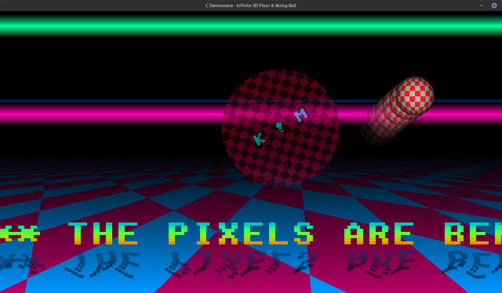

# infinite-3d-floor (C/SDL2)

A personal challenge porting yet another demoscene'ish (_**cracktro**_) program from `Python3/PyGame` to `C` using `SDL2`, showing off classic Amiga "_infinite floor_" graphics effect, with accompanying scrolling copper raster text with water shimmering and a bouncing Boing Ball, **On Linux** :P

Should work on any Linux distribution (or Windows for that matter) that has `SDL2` + `SDL2-Mixer`.

Chiptune track provided by [CallRoll](https://archive.org/details/free-chiptune-collection-for-game-usage) (`Track01.wav`).

## Required:
```bash
sudo apt-get install build-essential libsdl2-dev libsdl2-mixer-dev
```

Usage:
```bash
$ ./infinite-3d-floor -f / --fullscreen /  -w 1280 -h 720 / --width 1280 --height 720
```

#### How:
- **Perspective Floor**: map the 2D screen pixels of the bottom half of the screen into 3D world space using a depth divisor (Distance $Z = \frac{\text{Camera Height}}{Y}$).
- **Rotozoomer Overlay**: A smaller, floating texture (like a logo or text) spinning and scaling smoothly across the screen, rendered directly into the pixel buffer on top of the 3D floor.
- **Boing Ball**: The "Boing Ball" is the ultimate crown jewel of the Amiga demoscene! To do it justice, we won’t just move a flat 2D sprite around. We will use NumPy to calculate a true 3D raycasted sphere with a wrapping checkerboard texture that dynamically rotates and depth-shades itself using volume lighting every single frame.
- **"Copper" Raster Text + Shimmering Water Reflection**: horizontal scrolling "copper" raster text, computing a second set of inverted pixels rendered below the text, then applying high-frequency trigonometry to create a shimmering water effect.
- **"Copper" Raster Bars**: classic Amiga "Copper" raster bar effect, we draw thick, horizontal gradients that sweep up and down the Y-axis using overlapping sine waves.


